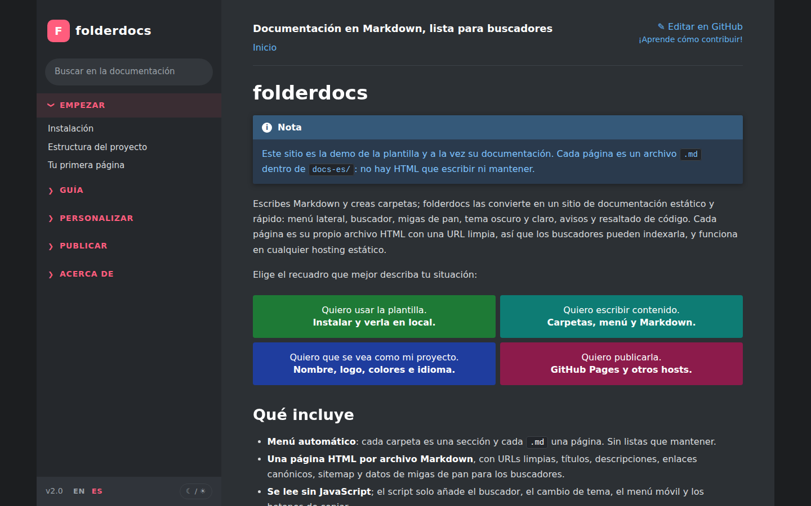

<div align="center">

# folderdocs

**Convierte archivos Markdown y carpetas en un sitio de documentación rápido. Tus carpetas son el menú, cada página es su propio HTML indexable y no hay nada que configurar para empezar.**

[](https://github.com/jrcesara7-bit/folderdocs/actions/workflows/ci.yml)
[](LICENSE)


[**Ver demo**](https://jrcesara7-bit.github.io/folderdocs/es/) · [Documentación](https://jrcesara7-bit.github.io/folderdocs/es/empezar/instalacion/) · [Reportar un error](https://github.com/jrcesara7-bit/folderdocs/issues/new/choose) · [English](README.md)

<picture>
  <source media="(prefers-color-scheme: light)" srcset="docs-es/img/preview-light.png">
  
</picture>

</div>

## Para qué sirve

Es un pequeño generador de sitios estáticos para tener documentación presentable (de un proyecto, un producto, un equipo o tus apuntes) escribiendo solo `.md`. Creas una carpeta, añades un archivo y aparece en el menú con una URL limpia. No hay lista que mantener, ni framework que aprender, ni dependencias que instalar.

La estética se inspira en la documentación de Godot y en el tema Read the Docs: menú lateral con secciones plegables, migas de pan, avisos de colores y paginación anterior/siguiente.

> **¿Vienes de la 1.x?** La versión 2 publica una página HTML por cada archivo Markdown (URL limpias en lugar de `#/…`). Mira las [notas de migración](.github/es/CHANGELOG.md#200---2026-10-02).

## Características

- **Menú y URL automáticos**: cada carpeta es una sección, cada subcarpeta un grupo y cada `.md` una página en `/carpeta/pagina/`. Títulos desde el front matter o el primer `# H1`; orden por `order`, prefijo numérico (`01-`) o alfabético.
- **Una página HTML real por archivo Markdown**, legible sin JavaScript, con `<title>`, meta descripción, enlace canónico, etiquetas Open Graph, datos de migas de pan, `sitemap.xml`, `robots.txt` y `404.html`.
- **Comprobación de enlaces rotos** al compilar, para páginas, imágenes y archivos.
- **Buscador** de texto en el menú lateral, a partir de un índice generado al compilar, sin servicios externos (atajo: `/`).
- **Tema oscuro y claro**, recordado entre visitas. Los colores son variables CSS.
- **Markdown ampliado**: tablas, listas de tareas, avisos como los de GitHub (`> [!NOTE]`, `TIP`, `IMPORTANT`, `WARNING`, `CAUTION`), código resaltado con botón de copiar.
- **Enlaces e imágenes relativos** entre archivos `.md`, que también funcionan al verlos en GitHub.
- **Multilingüe**: una carpeta de documentación por idioma, con selector de idioma automático y enlaces `hreflang` (la demo de este repositorio se publica en inglés y español).
- **Adaptable a móvil**, con hoja de estilos de impresión y enlace «saltar al contenido».
- **Enlace «Editar en GitHub»** en cada página.
- **Nada que `npm install`**: `marked` y `highlight.js` van incluidos en `tools/vendor/` y solo se usan al compilar, así que el navegador descarga solo HTML, una hoja de estilos y un script de unas 150 líneas.
- **Flujos de GitHub Actions** listos: pruebas, compilación estricta y publicación en GitHub Pages.

## Inicio rápido

Necesitas [Node.js](https://nodejs.org) 18 o superior.

```bash
# 1. Usa la plantilla (botón "Use this template" en GitHub) o clónala
git clone https://github.com/jrcesara7-bit/folderdocs.git mi-documentacion
cd mi-documentacion

# 2. Arranca el servidor local (se reconstruye cada vez que guardas un archivo)
npm run dev
```

Abre <http://localhost:8000/es/> para la versión en español. Después:

1. Crea `docs-es/guia/hola.md` con `# Hola` y un párrafo.
2. Refresca el navegador: aparece en el menú, bajo **Guía**, en `/es/guia/hola/`.
3. Edita `docs-es/config.json` con el nombre y el repositorio de tu proyecto.

¿Un solo idioma? Borra la carpeta del otro. ¿Necesitas otro? Añade `docs-fr/` y se publica en `/fr/`.

## Cómo se organiza el contenido

```text
docs-es/
├── index.md                    portada (no sale en el menú)
├── config.json                 nombre, idioma, repositorio…
├── guia/                       → sección «Guía»
│   ├── _meta.json              { "title": "Guía", "order": 1 }   (opcional)
│   ├── instalacion.md          → /es/guia/instalacion/
│   └── avanzado/               → grupo desplegable
│       ├── index.md            → /es/guia/avanzado/ (la página del propio grupo)
│       └── 01-plugins.md       → /es/guia/avanzado/plugins/ (el prefijo fija el orden)
└── _borrador/                  lo que empieza con _ o . se ignora
```

Detalles en la [guía de organización](https://jrcesara7-bit.github.io/folderdocs/es/guia/organizar-contenido/).

## Personalización

| Qué | Dónde |
| --- | --- |
| Nombre, subtítulo, descripción, pie, repositorio, logo, URL del sitio | `config.json` de cada carpeta de documentación |
| Título, descripción, orden y enlace de traducción de una página | front matter al inicio de cada `.md` |
| Colores (tema oscuro y claro), tipografía, ancho | variables al inicio de `assets/css/theme.css` |
| Favicon y vista previa para redes | `assets/img/favicon.svg`, `assets/img/social-preview.png` |
| Textos de la interfaz o un idioma de interfaz nuevo | `tools/lib/i18n.mjs` |
| Diseño de la página | `tools/lib/template.mjs` |
| Un sitio en varios idiomas | [Guía de idiomas](https://jrcesara7-bit.github.io/folderdocs/es/personalizar/idioma/) |

## Publicar

`.github/workflows/pages.yml` construye el sitio y lo publica en GitHub Pages en cada push a `main`; la URL del sitio se detecta sola. Solo tienes que ir a **Settings → Pages → Source → GitHub Actions**. Para cualquier otro hosting estático (Netlify, Cloudflare Pages, nginx…), ejecuta `npm run build` y publica la carpeta `_site/`. Mira [Publicar](https://jrcesara7-bit.github.io/folderdocs/es/publicar/otros-hosts/).

## SEO: qué esperar

Cada página es indexable y lleva los metadatos que buscan los buscadores. Eso hace que posicionar sea *posible*, no seguro: depende de tu contenido, de los enlaces de otros sitios y de la antigüedad del dominio. Si usas un dominio propio, define `site.url` para que los enlaces canónicos y el sitemap sean correctos. Más en [SEO y limitaciones](https://jrcesara7-bit.github.io/folderdocs/es/publicar/seo-y-limitaciones/).

## Limitaciones

- Previsualizar y publicar necesitan Node.js (GitHub Pages ejecuta la compilación por ti).
- Sin versionado de documentación. Los idiomas funcionan como una carpeta por idioma.
- El buscador es de texto simple, pensado para cientos de páginas y no para miles.
- El HTML dentro de los `.md` no se filtra: no es apto para contenido de usuarios desconocidos.

Cómo se compara con MkDocs, Docusaurus, VitePress y Docsify: [Por qué folderdocs](https://jrcesara7-bit.github.io/folderdocs/es/acerca/por-que-esta-plantilla/).

## Desarrollo y contribuciones

```bash
npm run dev                  # servidor local, se reconstruye con cada cambio
npm run build                # construye el sitio en _site/
npm run build -- --strict    # ...y falla ante enlaces rotos
npm test                     # pruebas del generador
```

Las contribuciones son bienvenidas: lee [CONTRIBUTING](.github/es/CONTRIBUTING.md) antes de abrir una solicitud de cambio. Los cambios por versión están en el [CHANGELOG](.github/es/CHANGELOG.md).

## Créditos y licencia

- [marked](https://github.com/markedjs/marked) (MIT) y [highlight.js](https://highlightjs.org) (BSD-3-Clause), incluidos en `tools/vendor/`.
- Estética inspirada en [Godot Docs](https://docs.godotengine.org) y Read the Docs; no se usan sus recursos gráficos.

Distribuido bajo la licencia [MIT](LICENSE).
