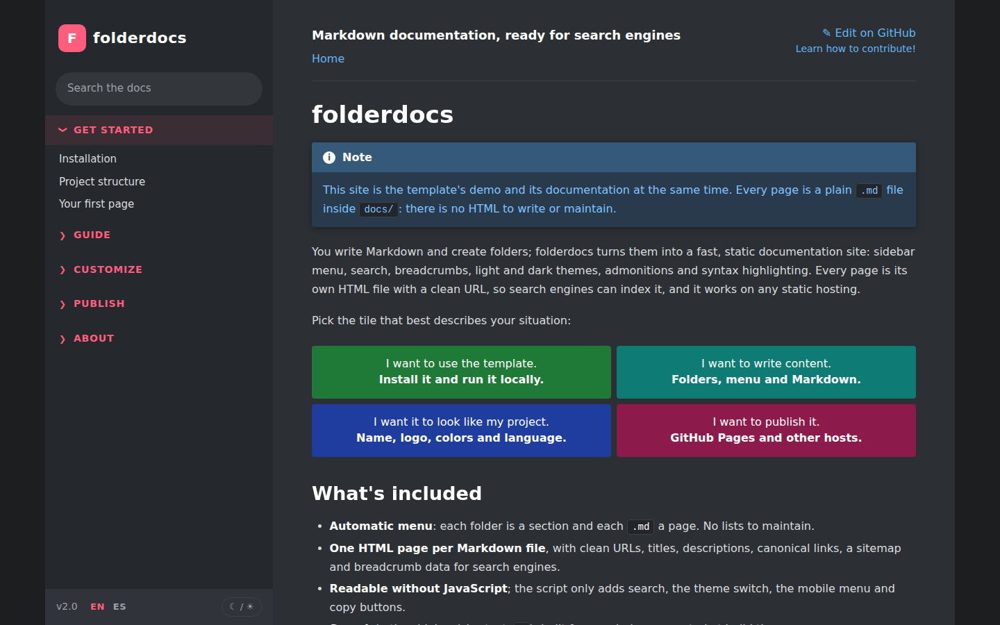

<div align="center">

# folderdocs

**Turn Markdown files and folders into a fast documentation site. Your folders are the menu, every page is its own indexable HTML file, and there is nothing to configure to get started.**

[](https://github.com/jrcesara7-bit/folderdocs/actions/workflows/ci.yml)
[](LICENSE)


[**Live demo**](https://jrcesara7-bit.github.io/folderdocs/) · [Documentation](https://jrcesara7-bit.github.io/folderdocs/get-started/installation/) · [Report a bug](https://github.com/jrcesara7-bit/folderdocs/issues/new/choose) · [Español](README.es.md)

<picture>
  <source media="(prefers-color-scheme: light)" srcset="docs/img/preview-light.png">
  
</picture>

</div>

## What it is

A small static site generator for presentable documentation (for a project, a product, a team or your own notes) where you only write `.md` files. Create a folder, add a file, and it shows up in the menu with a clean URL. There is no list to maintain, no framework to learn and no dependencies to install.

The look is inspired by the Godot documentation and the Read the Docs theme: collapsible sidebar sections, breadcrumbs, coloured admonitions and previous/next pagination.

> **Upgrading from 1.x?** Version 2 publishes one HTML page per Markdown file (clean URLs instead of `#/…`). See the [migration notes](CHANGELOG.md#200---2026-10-02).

## Features

- **Automatic menu and URLs**: each folder is a section, each subfolder a group, each `.md` a page at `/folder/page/`. Titles come from front matter or the first `# H1`; order from `order`, a numeric prefix (`01-`) or alphabetical.
- **One real HTML page per Markdown file**, readable without JavaScript, with `<title>`, meta description, canonical link, Open Graph tags, breadcrumb data, `sitemap.xml`, `robots.txt` and `404.html`.
- **Broken-link check** at build time for pages, images and files.
- **Text search** in the sidebar from an index generated at build time, no external service (shortcut: `/`).
- **Light and dark themes**, remembered between visits. Colours are CSS variables.
- **Extended Markdown**: tables, task lists, GitHub-style admonitions (`> [!NOTE]`, `TIP`, `IMPORTANT`, `WARNING`, `CAUTION`), highlighted code with a copy button.
- **Relative links and images** between `.md` files, which also work when browsing them on GitHub.
- **Multilingual**: one documentation folder per language, with an automatic language switcher and `hreflang` links (this repo's demo is published in English and Spanish).
- **Responsive**, with a print stylesheet, and a «skip to content» link.
- **«Edit on GitHub»** link on every page.
- **Nothing to `npm install`**: `marked` and `highlight.js` are bundled in `tools/vendor/` and used only at build time, so the browser downloads just HTML, one stylesheet and a ~150-line script.
- **GitHub Actions** included: tests, a strict build and GitHub Pages deployment.

## Quick start

You need [Node.js](https://nodejs.org) 18 or later.

```bash
# 1. Use the template ("Use this template" button on GitHub) or clone it
git clone https://github.com/jrcesara7-bit/folderdocs.git my-docs
cd my-docs

# 2. Start the local server (it rebuilds whenever you save a file)
npm run dev
```

Open <http://localhost:8000>. Then:

1. Create `docs/guide/hello.md` with `# Hello` and a paragraph.
2. Refresh the browser: it appears in the menu, under **Guide**, at `/guide/hello/`.
3. Edit `docs/config.json` with your project's name and repository.

Only one language? Delete `docs-es/`. Need another? Add `docs-fr/`, and it is published at `/fr/`.

## How content is organised

```text
docs/
├── index.md                    home page (not in the menu)
├── config.json                 name, language, repository…
├── guide/                      → section "Guide"
│   ├── _meta.json              { "title": "Guide", "order": 1 }   (optional)
│   ├── install.md              → /guide/install/
│   └── advanced/               → collapsible group
│       ├── index.md            → /guide/advanced/ (the group's own page)
│       └── 01-plugins.md       → /guide/advanced/plugins/ (prefix sets the order)
└── _drafts/                    anything starting with _ or . is ignored
```

Details in the [organisation guide](https://jrcesara7-bit.github.io/folderdocs/guide/organize-content/).

## Customisation

| What | Where |
| --- | --- |
| Name, subtitle, description, footer, repository, logo, site URL | `config.json` in each docs folder |
| Page title, description, order, translation link | front matter at the top of each `.md` |
| Colours (dark and light), typography, width | variables at the top of `assets/css/theme.css` |
| Favicon and social preview | `assets/img/favicon.svg`, `assets/img/social-preview.png` |
| Interface strings or a new interface language | `tools/lib/i18n.mjs` |
| Page layout | `tools/lib/template.mjs` |
| A site in several languages | [Languages guide](https://jrcesara7-bit.github.io/folderdocs/customize/languages/) |

## Publishing

`.github/workflows/pages.yml` builds the site and deploys it to GitHub Pages on every push to `main`; the site URL is detected automatically. Just go to **Settings → Pages → Source → GitHub Actions**. For any other static host (Netlify, Cloudflare Pages, nginx…), run `npm run build` and publish the `_site/` folder. See [Publish](https://jrcesara7-bit.github.io/folderdocs/publish/other-hosts/).

## SEO: what to expect

Every page is indexable and carries the metadata search engines look for. That makes ranking *possible*, not guaranteed: it depends on your content, links from other sites and the age of the domain. If you use a custom domain, set `site.url` so canonical links and the sitemap are right. More in [SEO and limitations](https://jrcesara7-bit.github.io/folderdocs/publish/seo-and-limitations/).

## Limitations

- Previewing and publishing need Node.js (GitHub Pages runs the build for you).
- No documentation versioning. Languages work as one folder per language.
- Search is plain text, built for hundreds of pages rather than thousands.
- HTML inside `.md` files is not sanitised: not suitable for content from untrusted users.

How it compares with MkDocs, Docusaurus, VitePress and Docsify: [Why folderdocs](https://jrcesara7-bit.github.io/folderdocs/about/why-this-template/).

## Development and contributing

```bash
npm run dev                  # local server, rebuilds on every change
npm run build                # build the site into _site/
npm run build -- --strict    # ...and fail on broken links
npm test                     # tests for the generator
```

Contributions are welcome: read [CONTRIBUTING.md](CONTRIBUTING.md) first. Release notes are in the [CHANGELOG](CHANGELOG.md).

## Credits and license

- [marked](https://github.com/markedjs/marked) (MIT) and [highlight.js](https://highlightjs.org) (BSD-3-Clause), bundled in `tools/vendor/`.
- Look inspired by [Godot Docs](https://docs.godotengine.org) and Read the Docs; none of their assets are used.

Released under the [MIT](LICENSE) license.
